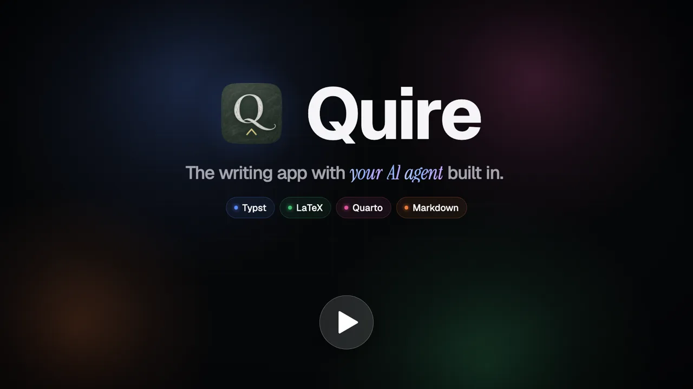
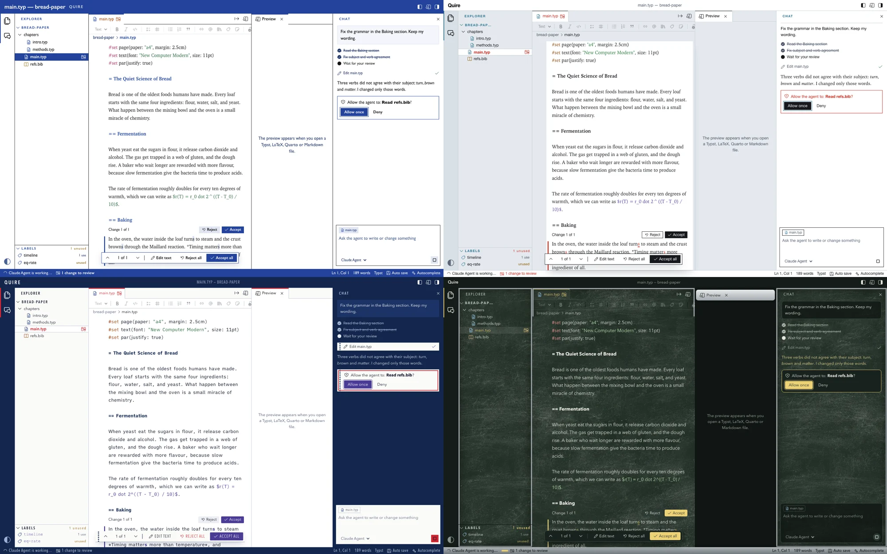

# Quire Writer

A macOS writing app for Typst, LaTeX, Quarto and Markdown with an AI agent of your choice
(Claude, Codex, Gemini and any other agent in the ACP registry), using your own agent login.
Every change the agent makes waits for your review. In the app it is called Quire.

[](https://andesprit.com/quire-writer/demo.mp4)

Watch the [2-minute video](https://andesprit.com/quire-writer/demo.mp4): the chat, review of every change, Cmd+K,
autocomplete, your own agent, Grammarly, themes, and how Quire compares with VS Code, Cursor and Claude Code.



- New project: pick Typst, LaTeX, Quarto or Markdown, then a folder. It gets a starter file
  (`main.typ`, `main.tex`, `index.qmd` or `main.md`) that shows how that kind of document
  looks. A file already there is never replaced. "Open project" opens an existing folder.
- Chat bar: ask the agent to write or change things in your folder.
- Cmd+K on selected text: ask for an edit of just that part.
- Autocomplete: grey text after you pause typing, Tab to accept. Toggle in the top bar.
- Track changes: every change the agent makes shows as a change to review.
  Accept or reject each one, edit it before you accept, or use
  "Restore files to before this message" in the chat to undo a whole turn.
- Live preview, next to the editor:
  - Typst: tinymist. Click text in the preview to jump to it in the editor; the preview
    follows the caret when it moves to another line.
  - LaTeX: the PDF, compiled on every save with your own TeX (`latexmk` from MacTeX or
    TeX Live, or else Tectonic). Chapters with `% !TEX root = main.tex` show the main file.
  - Quarto: `quarto preview`, which renders again on every save.
  - Markdown: drawn as you type, with math. No install needed.
  - PDF, Word or HTML (buttons at the top of the preview), for each kind of document. Typst
    and LaTeX start as PDF, Quarto and Markdown as HTML; each kind remembers its choice. The
    other views are the export, made again on every save. Quarto and Markdown as PDF need Quarto.
  - The export button next to them saves the document in the format the preview shows.
- Labels: a list under the explorer of every label in the project (Typst `<name>`, LaTeX
  `\label{name}`, Quarto `{#sec-name}`), how often it is used, and which ones nothing refers
  to. Click one to go to it.
- Cite by DOI or arXiv ID (formatting bar): adds the paper to your `.bib` file and the
  citation at the cursor (`@key`, `\cite{key}` or `[@key]`). Needs the internet (doi.org).
- Export (button at the right of the file tab): the whole document as PDF or Word, or as
  OpenDocument, web page, e-book, Markdown, LaTeX or Typst. PDF comes from tinymist (Typst),
  your TeX (LaTeX) or Quarto (Quarto, Markdown); Quarto documents get the other formats from
  Quarto, the rest from Pandoc (or the copy inside Quarto). Citations become formatted
  references. Build files stay out of the project.
- One look for documents: web pages and Word files from Typst, LaTeX and Markdown, and the
  Markdown preview, set the text in a book face with clean headings, tinted tables, quotes
  and code. Quarto documents keep Quarto's look and their own settings.
- Explorer: new file, new folder, rename (F2), delete (moves to the macOS Trash), right-click menu.
- Saving: auto save (default) or manual with Cmd+S; switch in the status bar. With auto save
  off, a dot marks unsaved changes and the app asks before closing them.
- Formatting bar: headings, bold, italic, math, lists, links, citations, footnotes, figures,
  tables, in the markup of the open file's language. A narrow editor wraps it onto two rows.
- Color themes (button at the bottom of the left bar): VS Code Dark Modern and Light Modern,
  and Quire's own Series, Galley, Coupon and Slate.
- Updates itself: a new version installs in the background and opens at the next start.
  Quire > Check for Updates looks right away.

## Install

Download the `.dmg` of the [latest release](https://github.com/Andesprit/quire-writer/releases/latest),
open it and drag Quire to Applications. Needs a Mac with Apple Silicon.

The agents run with your own tools and login: Node.js (22 or newer for Claude;
`brew install node`), and the agent's own sign-in (Claude Code, Codex). Quire > Check
Setup lists what the agent and each preview need, with the command that installs what is
missing. When an agent cannot start, the chat says why, with what the agent printed. The
whole log is in `~/Library/Logs/com.andesprit.quire/agent.log`. Known problems and their
fixes: [Troubleshooting](https://andesprit.com/quire-writer/troubleshooting.html).

Linux (x86_64) is experimental: take the `.AppImage` (most systems) or the `.deb` (Debian,
Ubuntu) from the same release. It is built and started on every change, but used far less
than the Mac app: please report what does not work. On Linux the shortcuts are Ctrl where
the app says Cmd, there is no menu bar, and the Quire themes fall back to other fonts.

## Privacy

Quire has no account, no telemetry and no server of its own. Your files stay on your Mac.
It goes online only for these:

- Your agent: it runs on your Mac with your own login. For chat, Cmd+K and autocomplete it
  sends your request and the parts of your project it reads to its provider. That
  provider's terms apply.
- Starting an agent the first time: `npx` or `uvx` download it from npm or PyPI.
- Citations by DOI or arXiv ID: one request to doi.org.
- Updates: a check on GitHub at start, once a day and when you choose Check for Updates, then
  the download of a new version.

Your own TeX, Quarto or Pandoc may go online on their own, for example to fetch packages.

## Run (macOS)

Needs Rust, `node`, `tinymist` (`brew install tinymist`), and an agent you are logged in
to (for Claude: Claude Code). For the LaTeX preview: MacTeX or Tectonic
(`brew install tectonic`). For the Quarto preview and Markdown PDF: Quarto. For Word and the
other export formats: Pandoc (`brew install pandoc`) or Quarto, which carries its own.

On Linux, also install Tauri's libraries (Debian and Ubuntu:
`sudo apt install libwebkit2gtk-4.1-dev libappindicator3-dev librsvg2-dev patchelf`), and
name the tinymist copy below `tinymist-x86_64-unknown-linux-gnu`.

```bash
cd web && npm install && npm run build && cd ..
mkdir -p build/bin && cp "$(which tinymist)" build/bin/tinymist-aarch64-apple-darwin  # once
cargo run --manifest-path src-tauri/Cargo.toml -- sample
```

It opens the app in its own window, with the `sample` folder. Use "New project" or "Open
project" for your own. The page is built into the program: after changing `web/`, run
`npm run build` there again before `cargo run`.

Checks: `cd web && npm run check` (types and self-checks) and
`cargo test --manifest-path src-tauri/Cargo.toml`.

## Build the app (macOS)

Also needs the Tauri CLI (`cargo install tauri-cli --version "^2" --locked`).

```bash
./build-app.sh
```

The `.app` and `.dmg` land in `src-tauri/target/release/bundle/`. The app carries tinymist;
LaTeX and Quarto previews use the TeX and Quarto installed on the Mac. Agents still need
their own tools (most need Node) and login. For Grammarly, use the Grammarly for Mac app.
App and agent logs: `~/Library/Logs/com.andesprit.quire/agent.log`.

## Release

1. Set the new version in `src-tauri/Cargo.toml` (the only place it lives) and commit.
2. Tag and push: `git tag v0.2.0 && git push origin main v0.2.0`.
3. The Release workflow builds, signs and notarizes the app and makes a draft release with
   the `.dmg`, the update bundle and `latest.json`. Publish the draft: from then on, installed
   copies find the update (they check at start and once a day).

The workflow needs these repository secrets:

- `TAURI_SIGNING_PRIVATE_KEY`: signs the updates (its public key is in `tauri.conf.json`).
  Lose it and installed copies can never update again: keep a backup.
- Apple, to sign and notarize: `APPLE_CERTIFICATE` (the Developer ID Application `.p12`,
  base64), `APPLE_CERTIFICATE_PASSWORD`, `APPLE_SIGNING_IDENTITY`
  (`Developer ID Application: Name (TEAMID)`), `APPLE_ID`, `APPLE_PASSWORD` (an app-specific
  password) and `APPLE_TEAM_ID`. Without them the app is signed ad hoc and macOS warns on
  first open.

## How it works

- `src-tauri/`: one Rust program that shows the page in a window. The page and the Rust side
  talk through Tauri's own messages: there is no server and no open port.
- `src-tauri/src/project.rs`: the open folder: files, previews, export, citations. Any file
  change not made by the editor becomes a change to review. LaTeX build files go to a
  temporary folder, not into the project. The preview loads from `quire://localhost`, an
  address only the app has: the Markdown and PDF viewers, the project's images, the PDF.
- `src-tauri/src/agent.rs`: talks ACP to one agent process with three sessions: chat, inline edits,
  autocomplete (smallest model the agent offers). Agents come from `agents.json`, a copy
  of the ACP registry. With flow-atelier installed, `atelier harness sync` writes a newer
  copy that the app uses instead. An agent that quits on its own is started again, unless it
  quits within 30 seconds of starting; then a click on it in the status bar starts it.
- `src-tauri/templates/`: the starter files of "New project", built into the program.
- `web/`: the page. `main.ts` is the editor, `format.ts` the formatting bar, `chat.ts` the
  chat and `ui.ts` small shared helpers. The editor is a plain text field, so Grammarly and the
  spellchecker work in it; a colored copy of the text is drawn behind it (`web/highlight.ts`).
  Track changes use the diff from `@codemirror/merge`. `web/markdown.ts` draws the Markdown
  preview (marked and KaTeX), `web/pdf.ts` the PDFs (pdf.js), `web/docx.ts` the Word files
  (docx-preview) and `web/html.ts` the web pages.

## Contributing

Bug reports, ideas and pull requests are welcome: see [CONTRIBUTING.md](CONTRIBUTING.md).
Every commit needs a `Signed-off-by` line (the Developer Certificate of Origin):
`git commit -s`. Security problems go to a private report: see [SECURITY.md](SECURITY.md).

## License

GPL-3.0-or-later. See `LICENSE`.

## Credits

- Icons: [Codicons](https://github.com/microsoft/vscode-codicons) by Microsoft, CC BY 4.0.
- Manuscript font: [iA Writer Quattro](https://github.com/iaolo/iA-Fonts) by Information Architects, SIL Open Font License 1.1.
- Markdown: [marked](https://github.com/markedjs/marked), MIT. Math: [KaTeX](https://katex.org), MIT.
- PDF: [pdf.js](https://github.com/mozilla/pdf.js) by Mozilla, Apache 2.0.
- Typst preview: [tinymist](https://github.com/Myriad-Dreamin/tinymist), Apache 2.0, bundled with the app.
